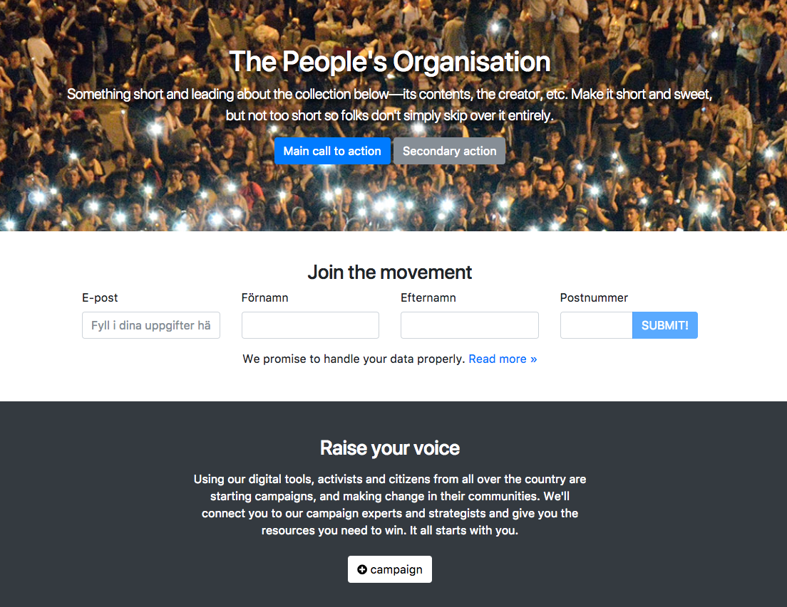

# OPEN Generic Wordpress Theme

Based on Sage 9.0.0-beta. See [https://github.com/roots/sage](https://github.com/roots/sage) for more detailed setup instructions, and [http://wp-sample.the-open.net](http://wp-sample.the-open.net) for an example.

*Note: This repository only contains a theme. You'll need to load it up inside an actual wordpress site.*

## Initial setup

* Clone this repository into your `themes` folder
* In the new theme folder, run `composer install`
* Install yarn and other JS deps with `npm install` or, for production use: `npm install --production`

## Theme development

* Run `yarn` from the theme directory to install dependencies
* Update `resources/assets/config.json` settings:
  * `devUrl` should reflect your local development hostname
  * `publicPath` should reflect your WordPress folder structure (`/wp-content/themes/sage` for non-[Bedrock](https://roots.io/bedrock/) installs)
* Use `npm start` to run with webpack's live updating

## Deploy to DigitalOcean

* Create a new droplet using the WordPress One-click app (make sure your ssh key is loaded and active for this droplet, so you don't have to enable a password for root)
* SSH into your new droplet with `ssh root@<your-new-IP>`
  * `apt-get upgrade`
  * `apt-get update`
  * Install Composer and NodeJS `apt-get install composer nodejs npm`
* Go back to the "Initial setup" steps and do those as normal

### Build commands

* `yarn run start` — Compile assets when file changes are made, start Browsersync session
* `yarn run build` — Compile and optimize the files in your assets directory
* `yarn run build:production` — Compile assets for production

## Documentation

Sage 9 documentation is currently in progress and can be viewed at [https://github.com/roots/docs/tree/sage-9/sage](https://github.com/roots/docs/tree/sage-9/sage).

Controller documentation is available at [https://github.com/soberwp/controller#usage](https://github.com/soberwp/controller#usage).
